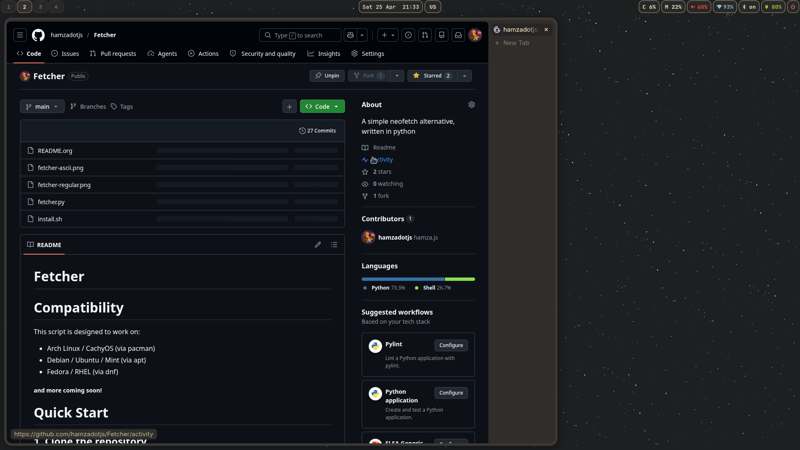
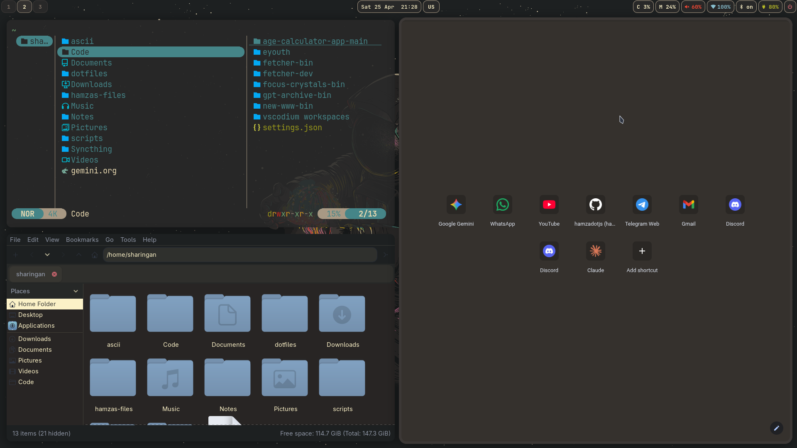

#+title: Niri config for Work
#+author: hamza
* Welcome to yet another WC config for work "niri"!
[[file:./img/rice.png]]

** Here, I have all my config for
        - Niri (scrolling Wayland Compositor)
        - foot (terminal)
        - Emacs (doom configs, not sure if it works just with copying and pasting a folder)
        - .Zshrc (config file for zsh shell)
        - gruvbox gtk configs (gtk 3 and 4)
        - gruvbox fuzzel config (for menus in waybar)
        - waybar (gruvboxidized, and media player needs fixes)
        - Fetcher (well its not a config its the program itself)
        - Helium for fast-private and minimal browsing
        - yazi and/or pcmanfm (File managers, yazi is CLI and pcmanfm is GUI, Nice to have both)
        - ttf-jetbrains-mono-nerd (Nice monospaced font)
* Main Features
-  1. Gruvbox color scheme for an easy-to-read enviroment
-  2. Minimal
-  3. Emacs. you have an OS in your terminal!
-  4. consistency. Everything is one colorscheme
-  5. Mako! we have a notification daemon!
-  6. doom emacs features
  -   6.1 org-modern with a beutiful config
  -   6.2 gruvbox theme!
  -   6.3 lsp for web, kotlin, and others
  -   6.4 neotree autostart, just like noevim!
- Helium for browsers (no firefox bloatware)
- Pcmanfm for GUI file manager, Minimal, fast, and GTK so free theme!
- yazi for real file managment, CLI, and powerfull
* How to apply
** Initials : install deps, for example, on arch
*** We'll use the AUR to install packages, so, lets grab an AUR helper, let's use paru because it's easy to use.
***** install paru
#+BEGIN_SRC bash
sudo pacman -S --needed base-devel
git clone https://aur.archlinux.org/paru.git
cd paru
makepkg -si
#+END_SRC
**** Install all the deps
#+BEGIN_SRC bash
paru -S helium-browser-bin awww wofi waybar pcmanfm yazi emacs foot zsh ttf-jetbrains-mono-nerd
#+END_SRC
*** Then, install doom emacs
#+BEGIN_SRC bash
git clone --depth 1 https://github.com/doomemacs/doomemacs ~/.config/emacs
~/.config/emacs/bin/doom install
#+END_SRC
*** After that, install fetcher
#+BEGIN_SRC bash
git clone https://github.com/hamzadotjs/Fetcher.git
cd Fetcher
chmod +x install.sh
./install.sh
#+END_SRC
** Applying the config:
*** First, clone the project as so:
#+BEGIN_SRC bash
  git clone https://github.com/hamzadotjs/dotfiles.git
#+END_SRC

*** Second, copy/symlink all the dotfiles:
        #+BEGIN_SRC bash
            mv  ~/dotfiles/wallpapers ~/
            cp -r ~/dotfiles/* ~/.config
        #+END_SRC

***** or if you like symlinks
        #+BEGIN_SRC bash
            mv ~/dotfiles/wallpapers ~/
            ln -sf ~/dotfiles/* ~/.config
        #+END_SRC

*** Third, make helium look good
**** First, enable zen mode
***** open chrome://flags
***** enable helium-zen-mode
***** then enable it in settings --> appearance, and enable vertical tabs.
** enjoy!
