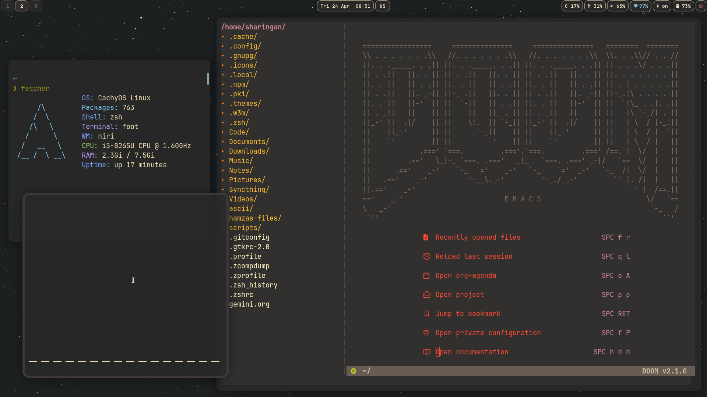

#+title: Readme
#+author: hamza
* Welcome to the ILinux config!
** Here, I have all my config for
        - Niri (scrolling Wayland Compositor)
        - foot (terminal)
        - Emacs (doom configs, not sure if it works just with copying and pasting a folder)
        - .Zshrc (config file for zsh shell)
        - gruvbox gtk configs (gtk 3 and 4)
        - gruvbox fuzzel config (for menus in waybar)
        - waybar (gruvboxidized, and media player needs fixes)
* Main Features
-  1. Gruvbox color scheme for an easy-to-read enviroment
-  2. Minimalism. you're be able to read the configs easyily
-  3. Emacs. you have an OS in your terminal!
-  4. consistency. Everything is one colorscheme
-  5. Mako! we have a notification daemon!
-  6. doom emacs features
  -   6.1 org-modern with a beutiful config
  -   6.2 gruvbox theme!
  -   6.3 lsp for web, kotlin, and others
  -   6.4 neotree autostart, just like noevim!
* How to apply:
** Initials : install deps, for example, on arch
#+BEGIN_SRC bash
sudo pacman -S niri mako foot zsh waybar emacs
#+END_SRC
*** then, install doom emacs
#+BEGIN_SRC bash
git clone --depth 1 https://github.com/doomemacs/doomemacs ~/.config/emacs
~/.config/emacs/bin/doom install
#+END_SRC
** First, clone the project as so:
#+BEGIN_SRC bash
  git clone https://github.com/hamzadotjs/dotfiles.git
#+END_SRC

** Second, copy/symlink all the dotfiles:
        #+BEGIN_SRC bash
        cp -r ~/dotfiles/* ~/.config
        #+END_SRC
***** or if you like symlinks
        #+BEGIN_SRC bash
        ln -sf ~/dotfiles/* ~/.config
        #+END_SRC

** enjoy!

* Screenshots

